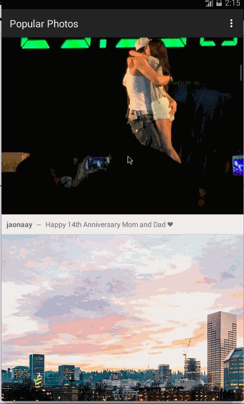

# InstagramClient

This is an Android application developed while learning about Android in Workshop. It is the most simple Instagram Client app to view popular photos. Tutorial provided by thecodepath.

Time spent: 5 hours spent in total

Completed user stories:

 * [x] Required: User can scroll through current popular photos from Instagram
 * [x] Required: For each photo displayed, user can see Graphic, Caption, Username
 
Notes:

Spent time setting up environment

Walkthrough of all user stories:

GIF created with [LiceCap](http://www.cockos.com/licecap/).
